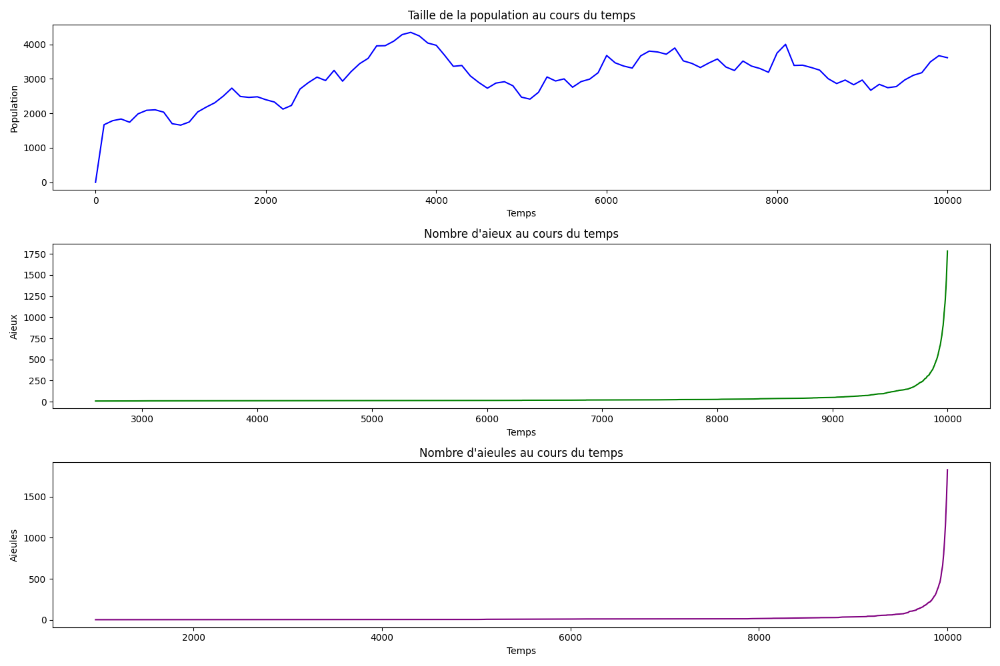

# Nos ancêtres communs (Projet Coalescence)

## Aperçu

<div align="center">
    
</div>

## Description

Ce projet simule l'évolution génétique d'une population et étudie la coalescence des lignées ancestrales à l'aide d'événements aléatoires (naissance, mort, reproduction). L'objectif principal est de produire, via une interface en ligne de commande, des séries temporelles sous forme de trois flux de données :

1. Temps vs taille de la population
2. Temps vs nombre de lignées paternelles restantes
3. Temps vs nombre de lignées maternelles restantes

Ces données peuvent ensuite être tracées ou analysées pour observer le comportement de la coalescence.

## Fonctionnalités

* **Modèle d'événements** : Génération d’événements de naissance, mort et reproduction en utilisant le modèle Gompertz–Makeham pour la mortalité et un processus de Poisson pour la reproduction.
* **File de priorité** : Implémentation d’une structure de tas binaire générique pour ordonner les événements par date.
* **Suivi des lignées** : Reconstruction des lignées paternelles et maternelles dans le temps, détection des événements de coalescence (fusion de lignées).
* **Interface CLI** : Exécutable Java acceptant deux arguments :

    1. `n` : nombre de fondateurs
    2. `tMax` : temps maximal de simulation
* **Échantillonnage** : Sortie de trois séries de données, échantillonnées tous les 100 ans, envoyées sur la sortie standard pour redirection ou traitement.
* **Étude empirique** : Possibilité d’exécuter plusieurs simulations avec les mêmes paramètres pour calculer des moyennes et écart-types des temps de coalescence.
* **Option bonus** (+1 point) : Analyse de la distribution des temps de coalescence Adam/Ève et de l’impact des différences de reproduction entre sexes.

## Structure du projet

```
src/
 └── pedigree/
   ├── AgeModel.java          # Modèle de génération de durées de vie aléatoires
   ├── Sim.java               # Classe de gestion de la simulation (création des events)
   ├── Event.java             # Représentation d’un événement individuel
   ├── Simulation.java        # Boucle principale et échantillonnage (§2.2)
   ├── Coalescence.java       # Algorithme de remontée des lignées (§2.3)
   └── Main.java              # Lance la simulation et gère la CLI (§2.4)
report/
 └── rapport.pdf            # Rapport détaillant implémentation et résultats
data/                       # Fichiers de sortie et traces éventuelles
README.md                   # Ce fichier
```

## Usage en ligne de commande

Le JAR exécutable `coalescence.jar` prend en arguments :

```bash
java -jar coalescence-1.0.jar <n> <tMax> > sortie.csv
```

* `<n>` : nombre de fondateurs (entier)
* `<tMax>` : temps maximal de simulation (nombre à virgule ou entier)
* `> sortie.csv` : redirige les trois colonnes de données vers un fichier CSV à trois champs (popSize, paternalLines, maternalLines)

### Exemple

```bash
java -jar coalescence.jar 1000 10000 > resultats.csv
```

## Structure du dépôt GitHub

```
├── src/               # Code source Java
├── report/            # Rapport PDF du projet
├── data/              # Sorties d’exemple et traces
├── test/              # Fichiers et scripts de test (ex. graphes)
├── .gitignore
├── coalescence.jar    # JAR exécutable généré
└── README.md          # Ce fichier
```

## Auteurs

- **Josué Mongan**

GitHub : [Josh012006](https://github.com/Josh012006)

- **David Stanescu**

GitHub : [DavidStanescu13](https://github.com/DavidStanescu13)

